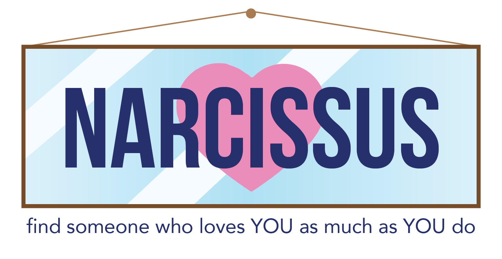

# Narcissus-Dating-App

  

## Assignment
* Build a compatability-based "FriendFinder" application... basically a dating app.
* Take results from user's surveys and compare to those from other users.
* Once finding the best match, display.

## Technologies Used
* Node.js
* JavaScript
* Express

## Demo Time!
*Narcissus* is deployed to Heroku. Check it out [here](https://narcissus-dating-app.herokuapp.com/).
